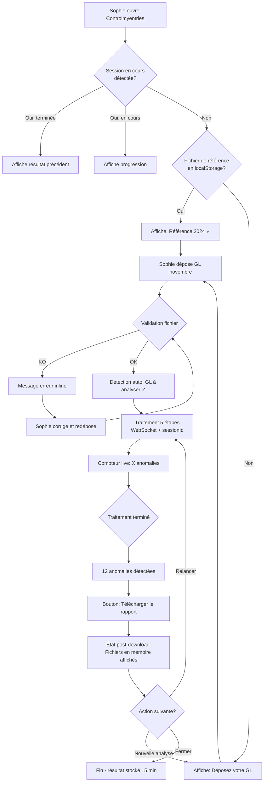
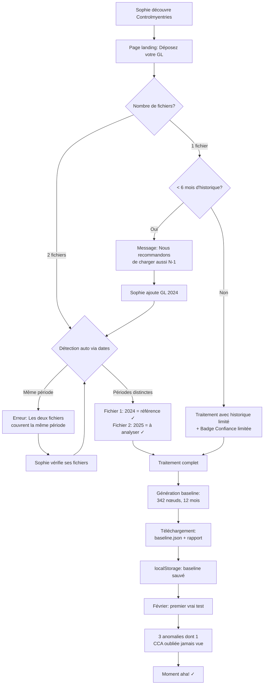
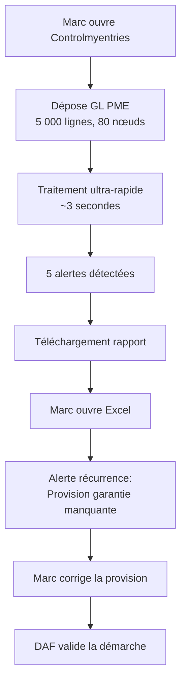
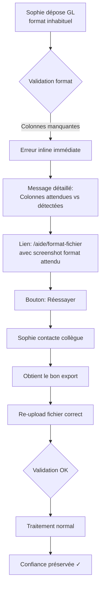
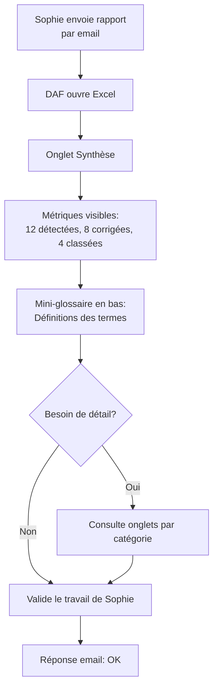

# UX Design Specification — Controlmyentries

**Author:** Louis Aubé
**Date:** 2026-02-05

---

## Executive Summary

### Project Vision

Controlmyentries est un outil web SaaS stateless (modèle ilovepdf) de détection automatique d'anomalies comptables. L'expérience UX cible est la simplicité radicale : upload → attente engageante (≤30s) → téléchargement d'un rapport Excel enrichi. Zéro inscription, zéro persistance, zéro friction.

### Target Users

- **Sophie** (persona primaire) : contrôleuse de gestion, réseau de crèches, clôture mensuelle, GL 500+ nœuds, desktop au bureau. Expertise comptable forte, tech-savvy moyenne. Frustrée par le contrôle visuel TCD (4h, oublis fréquents).
- **Marc** (variante) : chef comptable PME, GL plus petit (~100 nœuds), même workflow simplifié.
- **DAF** (secondaire) : consommateur des résultats, lit l'onglet Synthèse du rapport Excel. N'utilise pas l'outil directement.

### Key Design Challenges

1. **Double upload & concept de baseline** : l'utilisateur doit comprendre et gérer deux fichiers (baseline.json + GL mensuel). L'onboarding première utilisation (génération de baseline depuis GL N-1) est le principal point de friction.
2. **Attente de 30 secondes engageante** : transformer une attente passive en anticipation active via feedback temps réel (5 étapes WebSocket, barre de progression, compteur d'anomalies).
3. **WCAG 2.2 AAA sans compromis esthétique** : contraintes de contraste (7:1), tailles de cibles (24×24px), navigation clavier intégrale. Doit rester visuellement professionnel.
4. **Gestion de fichier côté client** : baseline.json stocké sur le poste de l'utilisateur entre les clôtures mensuelles. Risque de perte ou confusion.

### Design Opportunities

1. **Simplicité radicale** : une page, une action, valeur immédiate. Drop zone dominante, zéro navigation complexe.
2. **Moment "aha" orchestré** : compteur d'anomalies détectées en temps réel pendant le traitement → révélation progressive de la valeur.
3. **Accessibilité comme identité** : typographie forte, contrastes nets, palette épurée = sérieux comptable + WCAG AAA natif.
4. **Desktop-first** : espace généreux pour des visualisations claires du processus et des états.

## Core User Experience

### Defining Experience

L'expérience Controlmyentries se résume en une phrase : **"Dépose. Attends 30 secondes. Découvre."**

L'action core est l'upload + lancement d'analyse. C'est le seul point d'interaction significatif. Tout le reste (landing page, onboarding, download) est au service de cette action unique. Le produit n'a qu'une seule page fonctionnelle.

Le modèle mental est celui du **photocopieur intelligent** : on pose le document, on appuie sur le bouton, on récupère le résultat enrichi.

### Platform Strategy

| Aspect | Décision |
|---|---|
| Plateforme | Web SPA, navigateur uniquement |
| Navigateurs | Chrome, Edge (support primaire), Firefox, Safari (dégradé gracieux) |
| Input | Souris + clavier (desktop-first) |
| Offline | Non requis (traitement serveur obligatoire) |
| Responsive | Desktop optimisé, tablette fonctionnel, mobile non ciblé MVP |
| Capacités device | Drag-and-drop fichier (avec alternative clavier/bouton) |

### Effortless Interactions

1. **Upload** : drag-and-drop au centre de l'écran, zone visuellement dominante. Un fichier tombe → l'analyse commence. Aucun bouton "Lancer" séparé si possible.
2. **Baseline** : pour l'utilisateur récurrent, le flow est "2 fichiers → résultat". Le système guide visuellement (zone 1 : baseline, zone 2 : GL mensuel).
3. **Download** : le rapport Excel se télécharge automatiquement dès qu'il est prêt. Pas de page de résultats intermédiaire — le livrable EST le fichier Excel.
4. **Erreur** : fichier invalide → message inline immédiat avec colonnes détectées vs attendues + bouton "Réessayer" visible. Pas de page d'erreur séparée.
5. **Retour mensuel** : le navigateur se souvient du dernier baseline.json utilisé (localStorage). Sophie retrouve son contexte instantanément.

### Critical Success Moments

| Moment | Ce qui se passe | Risque si raté |
|---|---|---|
| **Premier upload** | Sophie dépose son GL N-1, voit la progression, obtient son baseline.json | Abandon définitif si confusion ou erreur |
| **Progression en temps réel** | Les 5 étapes défilent (validation → Passe 1 → 2 → 3 → terminé) avec compteur d'anomalies | L'utilisateur pense que l'outil a planté |
| **Ouverture du rapport** | Sophie ouvre l'Excel, voit l'onglet Synthèse : "12 anomalies détectées" | Si le rapport est confus, la valeur n'est pas perçue |
| **Découverte d'anomalie inconnue** | Sophie ouvre un onglet et trouve un oubli de CCA qu'elle n'avait pas repéré | C'est le "aha" — si ça n'arrive pas, le produit n'a pas prouvé sa valeur |
| **Retour M+1** | Sophie revient le mois suivant, retrouve son baseline, relance en 10 secondes | Si le baseline est perdu, friction de réonboarding |

### Experience Principles

1. **Une page, un but** : pas de navigation, pas de menu, pas de dashboard. L'outil fait UNE chose et la fait très bien. (Modèle ilovepdf)
2. **Montre, ne demande pas** : l'outil détecte automatiquement, sans configuration utilisateur au MVP. Pas de seuils à régler, pas de paramètres. Le Z-score s'adapte seul.
3. **Confiance par la transparence** : chaque détection montre ses données (Z-score, moyenne, écart-type, historique). Pas de boîte noire. L'utilisateur peut vérifier et apprendre.
4. **Disclosure progressive** : interface minimaliste en surface → richesse statistique dans le rapport Excel. La complexité est dans le livrable, pas dans l'outil.
5. **L'attente est le spectacle** : les 30 secondes de traitement ne sont pas un "temps mort" mais un moment de revelation progressive (compteur d'anomalies, étapes franchies).

## Desired Emotional Response

### Primary Emotional Goals

| Émotion cible | Moment | Traduction UX |
|---|---|---|
| **Soulagement** | Après l'analyse | "Enfin, je n'ai plus à scanner des colonnes pendant 4 heures" |
| **Confiance** | Tout au long | "L'outil me montre ses calculs, je peux vérifier" |
| **Efficacité** | Upload → résultat | "C'est fait en 30 secondes, je passe à autre chose" |
| **Découverte** | Lecture du rapport | "Il a trouvé un oubli de CCA que je n'avais pas vu" |

L'émotion dominante est le **soulagement productif** — la sensation qu'une tâche pénible et risquée (le contrôle visuel TCD) est désormais automatisée et fiable.

### Emotional Journey Mapping

| Étape du parcours | Émotion attendue | Émotion à éviter |
|---|---|---|
| **Découverte / Landing** | Curiosité professionnelle, crédibilité immédiate | Méfiance ("encore un outil gadget") |
| **Premier upload (onboarding)** | Guidé, rassuré | Confusion ("quel fichier mettre où ?") |
| **Attente (30s)** | Anticipation active, impatience positive | Anxiété ("ça marche ?"), ennui |
| **Réception du rapport** | Satisfaction immédiate, "ça a marché" | Déception ("c'est tout ?") |
| **Lecture détaillée** | Découverte, "aha moment" | Confusion ("je ne comprends pas les scores") |
| **Retour M+1** | Familiarité, routine efficace | Friction ("où est mon baseline ?") |
| **Erreur fichier** | Compréhension, action claire | Frustration, culpabilité |

### Micro-Emotions

- **Confiance vs Scepticisme** : CRITIQUE. Sophie est experte comptable — elle ne fera confiance qu'à un outil qui montre ses méthodes. Chaque Z-score affiché, chaque donnée source visible = confiance construite.
- **Accomplissement vs Frustration** : Sophie doit sentir qu'elle a FAIT son travail de contrôle, pas que l'outil l'a remplacée. Le rapport est son livrable, elle l'a "produit".
- **Excitation vs Anxiété** : pendant les 30 secondes, le compteur d'anomalies transforme l'anxiété de l'attente en excitation de la découverte.
- **Delight vs Simple satisfaction** : on vise la satisfaction fiable (comptable), pas le delight spectaculaire. Un outil sérieux, pas un jouet.

### Design Implications

| Émotion cible | Implication UX |
|---|---|
| Soulagement | Le flow complet upload→résultat doit être réalisable en < 2 minutes |
| Confiance | Transparence des calculs dans le rapport, pas de boîte noire |
| Efficacité | Zéro étape superflue, auto-download du rapport |
| Découverte | Compteur d'anomalies en temps réel, onglets par catégorie dans Excel |
| Guidé (onboarding) | Copie explicative inline, zones visuellement distinctes baseline/GL |
| Pas de confusion | Messages d'erreur avec colonnes détectées vs attendues |
| Anticipation (attente) | Barre de progression 5 étapes + compteur d'anomalies live |
| Familiarité (retour) | localStorage pour le dernier baseline, état visuel "prêt à relancer" |

### Emotional Design Principles

1. **Sérieux comptable, pas ludique** : ton professionnel, pas de gamification. Les comptables veulent un outil fiable, pas un jouet. Pas d'animations gratuites, pas d'emojis, pas de confetti.
2. **Transparence = confiance** : ne jamais cacher un calcul. Si l'outil détecte une anomalie, l'utilisateur doit pouvoir comprendre POURQUOI en < 10 secondes.
3. **L'attente est investie** : les 30 secondes sont conçues comme un moment de valeur (progression + compteur), pas comme un temps mort à minimiser visuellement.
4. **Erreur = aide, pas reproche** : chaque message d'erreur guide vers la solution. Jamais de "fichier invalide" sans explication actionnable.
5. **L'utilisateur reste l'expert** : l'outil détecte, l'utilisateur décide. Le rapport est un assistant, pas un juge. Vocabulaire : "détecté", "suggéré", jamais "erreur" ou "faute".

## UX Pattern Analysis & Inspiration

### Inspiring Products Analysis

#### 1. ilovepdf.com — Le modèle direct

| Aspect | Ce qu'ils font bien | Leçon pour Controlmyentries |
|---|---|---|
| **Onboarding** | Zéro — l'outil est auto-explicatif | Notre page doit être lisible en 5 secondes |
| **Upload** | Drop zone centrale massive | Copier ce pattern — zone unique même pour multi-fichiers |
| **Traitement** | Barre de progression simple | On fait MIEUX : 5 étapes détaillées + compteur live |
| **Download** | Bouton Download visible post-traitement | Bouton explicite (pas auto-download silencieux) |

**Pattern clé :** la page EST l'outil. Pas de navigation, pas de compte.

**Adaptation nécessaire :** ilovepdf gère UN fichier. Nous gérons 1-2 fichiers avec détection automatique via dates.

#### 2. Lighthouse / PageSpeed Insights — L'analyse technique lisible

| Aspect | Ce qu'ils font bien | Leçon pour Controlmyentries |
|---|---|---|
| **Score global** | Un chiffre unique (0-100) avec code couleur | Notre "X anomalies détectées" |
| **Progression** | Étapes visibles pendant l'analyse | Nos 5 étapes WebSocket (upgrade vs leur polling HTTP) |
| **Résultats** | Hiérarchie Synthèse → catégories → détails | Structure du rapport Excel |

**Pattern clé :** le résultat est auto-explicatif grâce à une hiérarchie claire.

#### 3. Stripe — L'onboarding bifurqué

| Aspect | Ce qu'ils font bien | Leçon pour Controlmyentries |
|---|---|---|
| **Setup flow** | Première visite = configuration guidée pas à pas | Premier usage = upload N-1 → génération baseline |
| **Daily flow** | Visites suivantes = accès direct au dashboard | Usages suivants = baseline + GL → rapport |
| **Détection d'état** | Le système sait si le setup est fait | Détection automatique : 1 fichier = premier usage possible, 2 fichiers = usage récurrent |

**Pattern clé :** ne pas traiter le premier usage comme les suivants.

#### 4. Notion — La structure hiérarchique

| Aspect | Ce qu'ils font bien | Leçon pour Controlmyentries |
|---|---|---|
| **Blocs hiérarchiques** | Header → sous-sections → détails repliables | Structure des onglets Excel (Synthèse → Catégorie → Détail) |

### Transferable UX Patterns

#### Patterns d'interaction

1. **Drop zone unique intelligente** : une seule zone accepte 1-2 fichiers. Le système détecte automatiquement baseline vs GL via les colonnes de date. Pas de labellisation manuelle.
2. **Détection auto du contexte** : si < 6 mois d'historique détecté dans un fichier unique → conseil inline "Nous recommandons de charger également votre GL de l'année précédente pour une détection plus fiable". L'utilisateur dépose le second fichier, le système reconnaît automatiquement via les dates.
3. **Feedback explicite post-détection** : après upload de 2 fichiers, afficher clairement "Fichier 1 : GL 2024 (référence) ✓ | Fichier 2 : GL janvier 2025 (à analyser) ✓". Si ambiguïté → message clair avec boutons radio pour préciser.
4. **Progression WebSocket 5 étapes** (adaptation Lighthouse) : upgrade technique vs polling. Compteur d'anomalies live.
5. **Bouton download explicite** (correction ilovepdf) : pas d'auto-download silencieux (risque popup-blocker + WCAG). Fichier prêt → bouton "Télécharger le rapport" immédiatement visible.
6. **Alternative clavier équivalente** (WCAG AAA) : bouton "Choisir fichier(s)" aussi visible que la drop zone.
7. **Nom de fichier explicite** : le rapport téléchargé s'appelle `Controlmyentries_Rapport_2025-01_[Entité].xlsx`, pas `report.xlsx`. Facilite l'archivage professionnel.

#### Patterns visuels

1. **Hiérarchie Synthèse → Détail** : compteur principal visible immédiatement, détails en drill-down (rapport Excel).
2. **Code couleur sémantique + formes** : vert/orange/rouge + icônes pour WCAG (daltonisme).
3. **Ton professionnel sobre** : palette réduite, pas de décorations.

#### Patterns de micro-copie

1. **Vocabulaire utilisateur, pas technique** : jamais "baseline" dans l'UI → "GL de l'année précédente" ou "historique de référence".
2. **Micro-copie progressive** :
   - Premier usage : "Déposez votre Grand Livre de l'année précédente (2024)"
   - Usages suivants : "Déposez votre GL mensuel"
   - Pendant traitement : "Analyse en cours... 3 anomalies détectées"
   - Résultat : "Rapport prêt — 12 anomalies à examiner"

### Anti-Patterns to Avoid

1. **Deux zones de drop séparées** : confusion "lequel où ?". → Zone unique + détection auto via dates.
2. **Traiter premier usage = usages suivants** : si Sophie arrive sans historique et voit "déposez 2 fichiers", elle est perdue. → Détection du contexte + guidage adapté.
3. **Auto-download silencieux** : bloqué par navigateurs modernes. → Bouton explicite.
4. **Drop-zone sans alternative clavier** : échec WCAG AAA. → Bouton équivalent visible.
5. **localStorage seul pour baseline** : risque de perte (cache vidé, autre navigateur). → localStorage + download explicite du fichier de référence à chaque génération.
6. **Résultats in-browser** : le livrable EST le fichier Excel. Pas de tableau web. (Note : un preview web léger type WeTransfer a été discuté et explicitement écarté pour le MVP — KISS.)
7. **Configuration pré-analyse** : le Z-score s'adapte seul. Zéro paramètre.
8. **Jargon technique dans l'UI** : "baseline", "Z-score" → vocabulaire métier comptable uniquement.

### Design Inspiration Strategy

**Adopter :**
- Drop zone centrale dominante (ilovepdf)
- Bouton download explicite post-traitement
- Hiérarchie Synthèse → Détail (Lighthouse/Notion)
- Nom de fichier explicite pour archivage pro

**Adapter :**
- Zone unique multi-fichiers avec détection auto via dates (notre innovation)
- Onboarding bifurqué setup/daily (Stripe) → premier usage vs récurrent
- WebSocket progression (upgrade vs Lighthouse polling)
- localStorage + fallback download explicite pour fichier de référence
- Feedback explicite post-détection ("Fichier 1 = référence ✓")
- Micro-copie progressive sans jargon technique

**Éviter :**
- Dual-drop zones labellisées → zone unique intelligente
- Auto-download silencieux → bouton explicite
- Premier = suivant → détection contexte + guidage adapté
- Preview web des résultats → MVP KISS, le fichier Excel EST le livrable

## Design System Foundation

### Design System Choice

**Tailwind CSS + react-dropzone + HTML sémantique**

Stack minimaliste sans framework UI. Maximum de contrôle, minimum de dépendances.

### Rationale for Selection

1. **KISS absolu** : pour 4 composants (drop zone, progress, button, toast), pas besoin d'une lib UI. HTML sémantique + Tailwind + ARIA manuel suffit.

2. **react-dropzone pour le cœur** : le composant central (drop zone multi-fichiers) bénéficie d'une lib mature (8KB, testable, accessible). Le reste est natif.

3. **Zéro abstraction inutile** : pas de portals, pas de layers Radix. DOM plat = tests E2E simples, debug facile.

4. **WCAG AAA natif** : on contrôle chaque attribut ARIA, chaque focus state. Pas de magie cachée.

5. **Évolutif** : si besoin de modales/menus complexes plus tard, on ajoute Radix. Mais pas avant d'en avoir besoin.

### Implementation Approach

| Composant UI | Solution |
|---|---|
| Drop zone | `react-dropzone` + styles Tailwind |
| Barre progression | `<progress>` HTML + `aria-valuenow` + Tailwind |
| Bouton download | `<button>` HTML + Tailwind |
| Messages d'état | `<div role="status" aria-live="polite">` + Tailwind |
| Feedback fichiers | HTML + Tailwind |

**Dépendances UI totales :**
- `tailwindcss` (dev)
- `react-dropzone` (~8KB)
- `@tailwindcss/forms` (plugin, dev)

### Customization Strategy

**Design tokens Tailwind (WCAG AAA vérifié) :**

```javascript
// tailwind.config.js
module.exports = {
  theme: {
    extend: {
      colors: {
        // Palette sobre, tous contrastes ≥ 7:1 sur blanc
        primary: '#1a1a2e',      // Texte principal (15.4:1)
        secondary: '#4a4a6a',    // Texte secondaire (7.1:1)
        accent: '#004080',       // Actions, liens (9.5:1) ✓ AAA
        success: '#0a5c32',      // Validation (8.2:1)
        warning: '#7c4a03',      // Alertes (7.3:1)
        error: '#991b1b',        // Erreurs (7.8:1)
        surface: '#ffffff',      // Fond principal
        muted: '#f5f5f7',        // Fond secondaire
      },
      fontFamily: {
        sans: ['Inter', 'Segoe UI', 'system-ui', 'sans-serif'],
      },
      minWidth: {
        'touch': '24px',         // WCAG AAA target size
      },
      minHeight: {
        'touch': '24px',
      },
    }
  },
  plugins: [
    require('@tailwindcss/forms'),
  ],
}
```

**Classes utilitaires WCAG :**

```css
/* Focus visible sur tous les interactifs */
.focus-ring {
  @apply focus:outline-none focus:ring-2 focus:ring-accent focus:ring-offset-2;
}

/* Taille minimum des cibles tactiles */
.touch-target {
  @apply min-w-touch min-h-touch;
}
```

## Defining Core Experience (Detailed)

### User Mental Model

**Comment Sophie résout ce problème aujourd'hui :**
- Export du GL depuis le logiciel comptable
- Création d'un TCD dans Excel
- Comparaison visuelle M vs M-1 colonne par colonne
- 4 heures de travail, yeux fatigués, oublis fréquents

**Modèle mental qu'elle apporte :**
- "Je cherche ce qui a bougé de façon anormale"
- "Le contrôle c'est du travail manuel et fastidieux"
- "Les outils automatiques sont souvent trop génériques"

**Ce qu'elle déteste dans l'approche actuelle :**
- Temps perdu sur des vérifications répétitives
- Risque d'oublier une anomalie par fatigue
- Aucune preuve de "couverture complète"

**Ce qu'elle aimerait :**
- Un outil qui fait le travail ingrat à sa place
- Qui lui montre ses calculs (pas une boîte noire)
- Qui lui laisse le dernier mot (elle reste l'experte)

### Success Criteria

| Critère | Cible | Mesure |
|---|---|---|
| **Temps upload → rapport** | < 45 secondes | Timer serveur |
| **Compréhension immédiate** | Page lisible en < 5 secondes | Test utilisateur |
| **Zéro configuration** | 0 paramètre avant analyse | Comptage UI |
| **Confiance dans les résultats** | Sophie peut vérifier chaque détection | Données source visibles |
| **Rétention mensuelle** | Sophie revient chaque clôture | Analytics |
| **Pertinence des détections** | ≥ 80% d'anomalies actionnables | Feedback utilisateur (pouce haut/bas optionnel) |

**L'utilisateur dit "ça marche" quand :**
1. Le fichier est accepté sans erreur (validation claire)
2. La progression montre que quelque chose se passe (pas de spinner vide)
3. Le compteur d'anomalies monte → excitation
4. Le rapport Excel s'ouvre et l'onglet Synthèse est immédiatement lisible
5. Une anomalie détectée correspond à un vrai oubli → "aha moment"

### Novel UX Patterns

**Pattern établi utilisé :**
- Drop zone centrale (ilovepdf) → familier, pas besoin d'apprentissage
- Barre de progression multi-étapes (Lighthouse) → familier

**Pattern adapté (notre innovation) :**
- **Smart dual-upload** : une zone unique accepte 1-2 fichiers, détection automatique via dates. Nouveau pour ce contexte, mais interaction familière (drag-and-drop).
- **Compteur live pendant traitement** : au lieu d'un simple "Processing...", le compteur d'anomalies monte en temps réel. Micro-animation bounce (scale 1.05 → 1.0, 200ms) quand le nombre change. Transforme l'attente en anticipation.

**Pas de pattern vraiment novel :**
Tout est basé sur des patterns connus. L'innovation est dans la combinaison et l'adaptation au contexte comptable. Aucune éducation utilisateur nécessaire.

**Métaphore utilisée :**
"Photocopieur intelligent" — tu poses ton document, tu appuies sur le bouton, tu récupères le résultat enrichi. Familier, zéro apprentissage.

### Experience Mechanics

#### 1. Initiation — Drop Zone États Visuels

| État | Style Tailwind | Description |
|---|---|---|
| **Idle** | `border-dashed border-2 border-secondary bg-surface` | Zone neutre, invitation à déposer |
| **Hover** | `border-dashed border-2 border-secondary bg-muted` | Survol souris, feedback subtil |
| **Drag-over** | `border-solid border-2 border-accent bg-accent/10` | Fichier au-dessus, prêt à recevoir |
| **Error** | `border-solid border-2 border-error bg-error/5` | Fichier rejeté |

**Contenu de la zone idle :**
- Icône upload centrée (24×24px minimum)
- Texte principal : "Déposez votre Grand Livre ici"
- Texte secondaire : "ou cliquez pour parcourir • .xlsx, .xls, .csv"

#### 2. Interaction

| Élément | Détail |
|---|---|
| Action utilisateur | Drag-and-drop fichier(s) OU clic bouton |
| Formats acceptés | .xlsx, .xls, .csv (affichés sous la zone) |
| Multi-fichiers | 1-2 fichiers acceptés simultanément |
| Détection auto | Système identifie référence vs GL à analyser via dates |
| Feedback immédiat | "Fichier reçu : GL_2024.xlsx ✓" |

#### 3. Feedback WebSocket (pendant traitement)

**Structure du message :**
```json
{
  "step": 3,
  "stepName": "Analyse Z-score",
  "progress": 0.6,
  "anomaliesFound": 7,
  "status": "processing"
}
```

| Étape | Message affiché | Durée estimée |
|---|---|---|
| 1 | "Validation du fichier..." | 2s |
| 2 | "Passe 1 : Tests binaires..." | 5s |
| 3 | "Passe 2 : Analyse Z-score..." | 15s |
| 4 | "Passe 3 : Classification..." | 5s |
| 5 | "Génération du rapport..." | 3s |

**Compteur live :** "X anomalies détectées" mis à jour après chaque passe. Animation bounce subtile à chaque changement.

**Gestion reconnexion WebSocket :**
1. Si déconnexion → "Reconnexion en cours..." (pas d'erreur brutale)
2. 3 tentatives avec backoff exponentiel
3. Si échec → fallback polling HTTP toutes les 2s

#### 4. Completion

**Message final WebSocket :**
```json
{
  "step": 5,
  "stepName": "Terminé",
  "progress": 1.0,
  "anomaliesFound": 12,
  "status": "complete",
  "downloadUrl": "/api/report/abc123"
}
```

| Élément | Détail |
|---|---|
| Signal de fin | "Rapport prêt — 12 anomalies à examiner" |
| Action principale | Bouton "Télécharger le rapport" (accent color, prominent) |
| Action secondaire | "Relancer l'analyse" (garde les fichiers en mémoire) |
| Téléchargement | `Controlmyentries_Rapport_2025-01.xlsx` |
| État post-download | "Nouvelle analyse" visible, fichier de référence conservé |
| Persistance | localStorage conserve le fichier de référence |

#### 5. Gestion d'erreur complète

| Erreur | Message | Action |
|---|---|---|
| Format non supporté | "Format non reconnu. Formats acceptés : .xlsx, .xls, .csv" | Réessayer |
| Colonnes manquantes | "Colonnes détectées : [liste]. Colonnes attendues : [liste]" | Lien doc |
| Fichier trop gros | "Fichier limité à 50 Mo. Votre fichier : X Mo" | Suggestion découpage |
| Fichier vide | "Le fichier est vide. Vérifiez que vous avez sélectionné le bon fichier." | Réessayer |
| Fichier corrompu | "Impossible de lire le fichier. Il semble corrompu ou protégé." | Réessayer |
| Timeout (>60s) | "L'analyse prend plus de temps que prévu. Patientez ou réessayez." | Attendre / Réessayer |
| 2 fichiers identiques | "Les deux fichiers semblent identiques. Vérifiez votre sélection." | Réessayer |
| Dates incohérentes | "Les dates du fichier 2 sont antérieures au fichier 1. Vérifiez l'ordre." | Réessayer |
| Erreur serveur | "Une erreur est survenue. Réessayez dans quelques instants." | Réessayer + Contact |

## Visual Design Foundation

### Color System

**Palette WCAG AAA (définie à l'étape 6) :**

| Token | Hex | Usage | Ratio sur blanc |
|---|---|---|---|
| `primary` | #1a1a2e | Texte principal, titres | 15.4:1 ✓ |
| `secondary` | #4a4a6a | Texte secondaire, labels | 7.1:1 ✓ |
| `accent` | #004080 | Boutons, liens, focus | 9.5:1 ✓ |
| `success` | #0a5c32 | Validations, checkmarks | 8.2:1 ✓ |
| `warning` | #7c4a03 | Alertes, avertissements | 7.3:1 ✓ |
| `error` | #991b1b | Erreurs, rejets | 7.8:1 ✓ |
| `surface` | #ffffff | Fond principal | — |
| `muted` | #f5f5f7 | Fond secondaire, hover | — |

**Principes couleur :**
- Pas de couleur seule pour transmettre l'information (WCAG)
- Toujours combiner couleur + icône ou forme
- Palette sobre = identité "sérieux comptable"

### Typography System

**Font stack :**
```css
font-family: 'Inter', 'Segoe UI', system-ui, sans-serif;
```

**Rationale :** Inter est optimisé pour les écrans, hauteur d'x généreuse, excellente lisibilité. Segoe UI comme fallback Windows natif.

**Type scale (base 16px) :**

| Token | Taille | Line-height | Usage |
|---|---|---|---|
| `text-xs` | 12px / 0.75rem | 1.5 | Labels secondaires, hints |
| `text-sm` | 14px / 0.875rem | 1.5 | Texte secondaire, metadata |
| `text-base` | 16px / 1rem | 1.5 | Texte principal, paragraphes |
| `text-lg` | 18px / 1.125rem | 1.4 | Texte emphasized |
| `text-xl` | 20px / 1.25rem | 1.3 | Sous-titres |
| `text-2xl` | 24px / 1.5rem | 1.25 | Titres de section |
| `text-3xl` | 30px / 1.875rem | 1.2 | Titre principal page |
| `text-4xl` | 36px / 2.25rem | 1.1 | Hero headline (landing) |

**Font weights :**
- `font-normal` (400) : texte courant
- `font-medium` (500) : labels, boutons
- `font-semibold` (600) : titres, emphasis

**Pas de font-bold (700)** — on garde un ton sobre, pas d'agressivité visuelle.

### Spacing & Layout Foundation

**Base unit : 4px**

Tous les espacements sont des multiples de 4px pour une grille cohérente.

| Token | Valeur | Usage |
|---|---|---|
| `space-1` | 4px | Micro-espacement (icône-texte) |
| `space-2` | 8px | Espacement serré (inline elements) |
| `space-3` | 12px | Espacement standard (form fields) |
| `space-4` | 16px | Espacement moyen (entre groupes) |
| `space-6` | 24px | Espacement large (sections) |
| `space-8` | 32px | Espacement très large |
| `space-12` | 48px | Séparateur de sections majeures |
| `space-16` | 64px | Marges externes page |

**Layout principles :**

1. **Single column centered** : pas de sidebar, pas de navigation complexe. Contenu centré, max-width 800px pour la lisibilité.

2. **Vertical rhythm** : tout est empilé verticalement. Drop zone → progression → résultat. Aucun layout horizontal complexe.

3. **Generous whitespace** : l'espace vide communique le calme et la confiance. Pas de densité "dashboard B2B".

4. **Desktop-first breakpoints :**
   - `≥1024px` : layout optimal, drop zone 60% viewport height
   - `768-1023px` : tablet, drop zone 50% viewport height
   - `<768px` : mobile (non ciblé MVP, mais fonctionnel)

**Grid : non utilisé.** La simplicité du layout (single column) ne nécessite pas de système de grille. Flexbox suffit.

### Accessibility Considerations

**WCAG 2.2 AAA compliance :**

| Critère | Cible | Implementation |
|---|---|---|
| Contraste texte | ≥ 7:1 | Tous tokens vérifiés (voir Color System) |
| Contraste UI | ≥ 3:1 | Bordures, icônes : `secondary` sur `surface` |
| Target size | ≥ 24×24px | `min-w-touch min-h-touch` sur tous les interactifs |
| Focus visible | Toujours visible | `focus:ring-2 focus:ring-accent focus:ring-offset-2` |
| Motion | Respecter prefers-reduced-motion | Désactiver animations si système le demande |

**Principes additionnels :**
- Pas de texte en image (tout est HTML)
- Pas de CAPTCHA (pas d'inscription)
- Navigation clavier complète (Tab, Enter, Escape)
- `aria-live="polite"` pour les mises à jour dynamiques (compteur, progression)
- Skip links non nécessaires (single page, pas de navigation)

**Taille de police minimum :** 12px (labels secondaires). Texte principal jamais sous 16px.

## Design Direction Decision

### Design Directions Explored

Étant donné l'extrême simplicité de l'UI Controlmyentries (single-page tool avec 4 composants), une exploration multi-directions n'est pas pertinente. La contrainte "modèle ilovepdf" + WCAG AAA + single column centered définit naturellement une direction unique.

**Directions NON explorées (et pourquoi) :**
- Dashboard multi-panneaux → hors scope (pas de dashboard)
- Navigation latérale → hors scope (pas de navigation)
- Layout en grille → over-engineering pour 4 composants
- Split-screen → inutile pour un flow linéaire unique

### Chosen Direction

**Direction : "Vertical Flow Centered"**

Layout minimaliste en colonne unique centrée, 100% du flow visible sans scroll au-dessus du fold (desktop).

**Structure verticale — État Idle :**

```
┌─────────────────────────────────────────────────────────────┐
│  Logo + Tagline (compact, top-left)                        │
├─────────────────────────────────────────────────────────────┤
│                                                             │
│                                                             │
│            ┌───────────────────────────────┐                │
│            │                               │                │
│            │      DROP ZONE                │                │
│            │   (60% viewport height)       │                │
│            │                               │                │
│            │   "Déposez votre GL ici"      │                │
│            │                               │                │
│            └───────────────────────────────┘                │
│                                                             │
│            [ Messages d'état / Erreurs ]                    │
│                                                             │
├─────────────────────────────────────────────────────────────┤
│  Footer minimal (mention légale, version)                   │
└─────────────────────────────────────────────────────────────┘
```

**État Processing :**

```
┌─────────────────────────────────────────────────────────────┐
│  Logo + Tagline                                             │
├─────────────────────────────────────────────────────────────┤
│                                                             │
│            ┌───────────────────────────────┐                │
│            │  Fichiers reçus :             │                │
│            │  ✓ GL_2024.xlsx (référence)   │                │
│            │  ✓ GL_2025-01.xlsx (analyse)  │                │
│            └───────────────────────────────┘                │
│                                                             │
│            ════════════════════════════                     │
│            Passe 2 : Analyse Z-score...                     │
│                                                             │
│                    7 anomalies                              │
│                     détectées                               │
│                                                             │
├─────────────────────────────────────────────────────────────┤
│  Footer                                                     │
└─────────────────────────────────────────────────────────────┘
```

**État Complete :**

```
┌─────────────────────────────────────────────────────────────┐
│  Logo + Tagline                                             │
├─────────────────────────────────────────────────────────────┤
│                                                             │
│            ┌───────────────────────────────┐                │
│            │        ✓ Analyse terminée     │                │
│            │                               │                │
│            │     12 anomalies détectées    │                │
│            │                               │                │
│            │  ┌─────────────────────────┐  │                │
│            │  │  Télécharger le rapport │  │                │
│            │  └─────────────────────────┘  │                │
│            │                               │                │
│            │  [ Relancer ] [ Nouvelle ]    │                │
│            └───────────────────────────────┘                │
│                                                             │
├─────────────────────────────────────────────────────────────┤
│  Footer                                                     │
└─────────────────────────────────────────────────────────────┘
```

### Design Rationale

1. **"The page IS the tool"** : aucune distraction. L'utilisateur voit immédiatement ce qu'il doit faire.

2. **Centered = attention focused** : drop zone au centre de l'attention, impossible à rater.

3. **Vertical stacking = flow naturel** : le regard descend naturellement de la zone d'action vers le résultat.

4. **Above the fold** : tout le flow visible sans scroll sur desktop 1024px+.

5. **State machine visible** : la page se transforme (idle → processing → complete) sans changer de route.

### Implementation Approach

**Container principal :**
```html
<main class="min-h-screen flex flex-col items-center justify-center px-4">
  <div class="w-full max-w-2xl">
    <!-- Logo -->
    <!-- Drop zone OR Progress OR Result -->
    <!-- Footer -->
  </div>
</main>
```

**Pas de HTML showcase séparé** : la simplicité du design ne justifie pas un fichier de 500 lignes. Les wireframes ASCII ci-dessus suffisent pour le MVP.

## User Journey Flows

### Parcours 1 — Sophie, contrôle mensuel (happy path)

**Contexte :** Sophie a déjà son fichier de référence (baseline). Elle revient chaque mois pour analyser son nouveau GL.



**Durée totale :** ~45 min (vs 4h avant)

**Gestion fermeture onglet :**
- Job continue côté serveur (fire-and-forget)
- Résultat stocké 15 min (TTL)
- Si Sophie revient avec même sessionId → affiche résultat
- Sinon → "Session expirée, veuillez relancer"

---

### Parcours 2 — Sophie, première utilisation (onboarding)

**Contexte :** Sophie découvre l'outil en janvier. Elle doit générer son fichier de référence.



**Point clé :** Le premier usage génère le fichier de référence. Les usages suivants le consomment.

---

### Parcours 3 — Marc, contexte PME

**Contexte :** Marc est chef comptable d'une PME. GL plus petit (5 000 lignes), mais mêmes besoins.



**Point clé :** L'outil scale vers le bas. Même pertinence sur petit volume.

---

### Parcours 4 — Sophie, fichier problématique (edge case)

**Contexte :** Sophie uploade un GL avec un format différent.



**Point clé :** Rejet gracieux > résultat faux. La confiance est la priorité.

---

### Parcours 5 — DAF, consommateur de résultats

**Contexte :** Le DAF ne touche pas l'outil. Il reçoit le rapport Excel de Sophie.



**Mini-glossaire inclus dans l'onglet Synthèse :**
- "Anomalie détectée" = écart statistiquement significatif par rapport à l'historique
- "Corrigée" = Sophie a validé et traité cette anomalie
- "Classée faux positif" = variation normale confirmée par Sophie

---

### Journey Patterns

| Pattern | Description | Usage |
|---|---|---|
| **Upload → Validation → Feedback** | Chaque upload déclenche validation immédiate avec feedback inline | Tous |
| **Détection auto via dates** | Le système reconnaît référence vs GL sans configuration | P1, P2 |
| **Progression visible** | 5 étapes + compteur live pendant traitement | P1, P2, P3 |
| **Rejet gracieux** | Erreur claire avec données détectées vs attendues + lien aide | P4 |
| **Session persistante** | sessionId + TTL 15 min pour reprise si fermeture onglet | P1, P2 |
| **État post-action** | Affichage des fichiers en mémoire après download | P1 |
| **Livrable = Excel** | Le rapport est le produit final, pas l'UI | Tous |

### Flow Optimization Principles

1. **Zéro étape avant valeur** : pas de formulaire, pas de configuration. Upload → résultat.

2. **Feedback immédiat** : chaque action utilisateur a une réponse visuelle < 200ms.

3. **Erreur = aide** : jamais "Erreur" seul. Toujours colonnes détectées vs attendues + lien `/aide/format-fichier`.

4. **State machine UI** : la page change d'état (idle → processing → complete) sans navigation.

5. **Deux flows distincts** :
   - Premier usage : génère le fichier de référence
   - Usages suivants : consomme le fichier de référence

6. **Confiance par transparence** : chaque anomalie montre ses données source. Mini-glossaire pour le DAF.

7. **Résilience session** : fermeture onglet ne perd pas le travail. Job continue, résultat récupérable 15 min.

## Component Strategy

### Design System Components

**Disponible :** Rien. Stack sans framework UI (KISS).

Le choix Tailwind CSS + react-dropzone + HTML sémantique signifie que nous n'avons pas de bibliothèque de composants pré-faits. Tout est construit sur mesure avec :
- Tailwind pour le styling
- HTML natif pour la sémantique
- ARIA manuel pour l'accessibilité
- react-dropzone pour le composant central

### Custom Components

**5 composants nécessaires pour le MVP :**

#### 1. DropZone

**Purpose :** Zone de dépôt de fichiers, cœur de l'interaction

**Content :**
- Icône upload (24×24px min)
- Texte principal : "Déposez votre Grand Livre ici"
- Texte secondaire : "ou cliquez pour parcourir • .xlsx, .xls, .csv"
- Bouton alternatif clavier visible

**Actions :**
- Drag-and-drop fichier(s)
- Clic pour ouvrir le sélecteur de fichiers
- Focus clavier + Enter

**States :**

| État | Classes Tailwind | Description |
|---|---|---|
| Idle | `border-dashed border-2 border-secondary bg-surface` | Invitation à déposer |
| Hover | `border-dashed border-2 border-secondary bg-muted` | Survol souris |
| Drag-over | `border-solid border-2 border-accent bg-accent/10` | Fichier au-dessus |
| Uploading | `border-solid border-2 border-accent animate-pulse` | En cours d'upload |
| Error | `border-solid border-2 border-error bg-error/5` | Fichier rejeté |

**Accessibility :**
- `role="button"` sur la zone cliquable
- `aria-label="Zone de dépôt de fichiers. Glissez-déposez ou appuyez sur Entrée pour parcourir"`
- `tabindex="0"` pour focus clavier
- Focus ring visible : `focus:ring-2 focus:ring-accent focus:ring-offset-2`
- Bouton "Choisir fichier(s)" alternatif visible (pas hidden)

**Implementation :** `react-dropzone` + Tailwind

```jsx
import { useDropzone } from 'react-dropzone';

function DropZone({ onFilesAccepted, state }) {
  const { getRootProps, getInputProps, isDragActive } = useDropzone({
    accept: {
      'application/vnd.openxmlformats-officedocument.spreadsheetml.sheet': ['.xlsx'],
      'application/vnd.ms-excel': ['.xls'],
      'text/csv': ['.csv']
    },
    maxFiles: 2,
    onDrop: onFilesAccepted
  });

  return (
    <div
      {...getRootProps()}
      className={`border-2 rounded-lg p-12 text-center cursor-pointer transition-colors
        ${isDragActive ? 'border-solid border-accent bg-accent/10' : 'border-dashed border-secondary bg-surface hover:bg-muted'}
        focus:outline-none focus:ring-2 focus:ring-accent focus:ring-offset-2`}
    >
      <input {...getInputProps()} />
      {/* Contenu */}
    </div>
  );
}
```

---

#### 2. FileCard

**Purpose :** Affiche un fichier uploadé avec son statut

**Content :**
- Icône type de fichier
- Nom du fichier (tronqué si > 30 caractères)
- Taille du fichier
- Rôle détecté : "Référence 2024" ou "À analyser (jan. 2025)"
- Statut : checkmark vert ou spinner

**Actions :**
- Bouton supprimer (×) accessible au clavier

**States :**

| État | Indicateur visuel |
|---|---|
| Validating | Spinner + texte "Validation..." |
| Valid | Checkmark vert + rôle affiché |
| Invalid | Icône erreur + message inline |

**Accessibility :**
- `aria-live="polite"` pour changements de statut
- Bouton supprimer : `aria-label="Supprimer le fichier [nom]"`

---

#### 3. ProgressTracker

**Purpose :** Affiche la progression en 5 étapes + compteur d'anomalies live

**Content :**
- 5 étapes numérotées avec labels
- Barre de progression
- Compteur d'anomalies détectées (mise à jour WebSocket)

**States :**

| État étape | Style |
|---|---|
| Pending | Cercle vide, texte `secondary` |
| Active | Cercle rempli `accent`, texte `primary`, pulse |
| Complete | Checkmark vert, texte `success` |

**Accessibility :**
- `<progress>` HTML natif avec `aria-valuenow`, `aria-valuemin`, `aria-valuemax`
- `aria-live="polite"` sur le compteur d'anomalies
- Labels explicites pour chaque étape

**Animation compteur :**
```css
@keyframes bounce {
  0%, 100% { transform: scale(1); }
  50% { transform: scale(1.05); }
}
.counter-update {
  animation: bounce 200ms ease-out;
}
```

**Respect prefers-reduced-motion :**
```css
@media (prefers-reduced-motion: reduce) {
  .counter-update { animation: none; }
}
```

---

#### 4. ResultCard

**Purpose :** Affiche le résultat final avec actions

**Content :**
- Icône succès (checkmark dans cercle)
- Titre : "Analyse terminée"
- Compteur final : "12 anomalies détectées"
- Bouton principal : "Télécharger le rapport"
- Boutons secondaires : "Relancer l'analyse" | "Nouvelle analyse"

**States :**

| État | Affichage |
|---|---|
| Complete | Bouton download prominent |
| Downloaded | "Rapport téléchargé ✓" + boutons secondaires visibles |

**Accessibility :**
- Bouton principal : `role="button"`, focus automatique à l'apparition
- `aria-describedby` lié au compteur d'anomalies
- Annonce vocale : `aria-live="assertive"` pour "Rapport prêt"

---

#### 5. StatusMessage

**Purpose :** Affiche erreurs, avertissements et informations

**Variants :**

| Variant | Couleur | Icône | Usage |
|---|---|---|---|
| Error | `error` + `bg-error/5` | ⚠️ | Fichier invalide, erreur serveur |
| Warning | `warning` + `bg-warning/5` | ⚡ | Historique < 6 mois |
| Info | `accent` + `bg-accent/5` | ℹ️ | Conseils, aide |
| Success | `success` + `bg-success/5` | ✓ | Confirmation action |

**Content :**
- Icône (jamais couleur seule — WCAG)
- Message principal
- Message secondaire (optionnel)
- Action (bouton optionnel)

**Accessibility :**
- `role="alert"` pour erreurs (lecture immédiate)
- `role="status"` pour info/success (lecture polie)
- Contraste ≥ 7:1 sur tous les textes

---

### Component Implementation Strategy

**Approche :**

1. **HTML sémantique first** : utiliser les éléments natifs (`<button>`, `<progress>`, `<input type="file">`) avant toute abstraction.

2. **Tailwind pour le styling** : pas de CSS custom sauf les animations. Utiliser les design tokens définis dans `tailwind.config.js`.

3. **ARIA explicite** : documenter chaque attribut ARIA dans le composant. Pas de "magie" — tout est visible dans le code.

4. **États via props** : chaque composant reçoit son état en prop, pas de state interne complexe. Facilite les tests.

5. **Composition simple** : composants plats, pas de nesting profond. La page assemble les 5 composants directement.

**Structure fichiers :**
```
src/components/
├── DropZone.tsx
├── FileCard.tsx
├── ProgressTracker.tsx
├── ResultCard.tsx
├── StatusMessage.tsx
└── index.ts
```

### Implementation Roadmap

**Phase 1 — Core Components (MVP day 1)**

| Composant | Priorité | Justification |
|---|---|---|
| DropZone | P0 | Point d'entrée unique, sans lui rien ne fonctionne |
| StatusMessage | P0 | Feedback erreurs/validation, critique pour la confiance |

**Phase 2 — Processing Components (MVP day 2)**

| Composant | Priorité | Justification |
|---|---|---|
| FileCard | P0 | Feedback immédiat post-upload |
| ProgressTracker | P0 | Engagement pendant les 30 secondes |

**Phase 3 — Completion Components (MVP day 3)**

| Composant | Priorité | Justification |
|---|---|---|
| ResultCard | P0 | Délivre la valeur (bouton download) |

**Tous les composants sont P0** — le flow est linéaire et chaque composant est nécessaire pour une étape du parcours. Pas de composant "nice to have" dans ce MVP KISS.

## UX Consistency Patterns

### Button Hierarchy

**3 niveaux de boutons :**

| Niveau | Usage | Style Tailwind | Exemple |
|---|---|---|---|
| **Primary** | Action principale unique par écran | `bg-accent text-white font-medium px-6 py-3 rounded-lg hover:bg-accent/90` | "Télécharger le rapport" |
| **Secondary** | Actions alternatives | `bg-transparent border border-secondary text-primary px-4 py-2 rounded-lg hover:bg-muted` | "Relancer l'analyse" |
| **Tertiary** | Actions mineures | `text-accent underline hover:text-accent/80` | "Nouvelle analyse" |

**Règles de hiérarchie :**
- Maximum 1 bouton Primary par état d'écran
- Secondary toujours à droite du Primary (lecture LTR)
- Tertiary en dessous ou séparé visuellement

**États de bouton :**

| État | Style | Description |
|---|---|---|
| Default | Couleurs normales | Repos |
| Hover | `hover:bg-accent/90` ou `hover:bg-muted` | Survol souris |
| Focus | `focus:ring-2 focus:ring-accent focus:ring-offset-2` | Focus clavier |
| Active | `active:scale-[0.98]` | Clic en cours |
| Disabled | `opacity-50 cursor-not-allowed` + `disabled` attribute | Non cliquable |
| Submitting | Spinner + `pointer-events-none` + `disabled` | Action en cours |

**Double-Submit Prevention :**
```jsx
<button
  disabled={isSubmitting}
  aria-disabled={isSubmitting}
  className={isSubmitting ? 'opacity-50 cursor-not-allowed pointer-events-none' : ''}
>
  {isSubmitting ? <Spinner /> : 'Télécharger'}
</button>
```

### Feedback Patterns

**4 types de messages (via StatusMessage component) :**

| Type | Couleur | Icône | Annonce | Usage |
|---|---|---|---|---|
| **Error** | `error` (#991b1b) | ⚠️ Triangle | `role="alert"` (immédiat) | Fichier rejeté, erreur serveur |
| **Warning** | `warning` (#7c4a03) | ⚡ Éclair | `role="status"` (poli) | Historique < 6 mois |
| **Info** | `accent` (#004080) | ℹ️ Info | `role="status"` | Conseils, aide contextuelle |
| **Success** | `success` (#0a5c32) | ✓ Check | `role="status"` | Fichier accepté, analyse terminée |

**Structure des messages d'erreur :**

```
┌─────────────────────────────────────────────────────────┐
│ ⚠️  [Titre court et actionnable]                        │
│     [Détail : ce qui a été détecté vs ce qui est attendu]│
│     [Lien ou bouton : action corrective]                │
└─────────────────────────────────────────────────────────┘
```

**Error Message Overflow :**
- Si liste de colonnes > 3 lignes : truncate + accordion "Voir détails"
- Tooltip sur colonnes tronquées

**Timing des feedbacks :**
- Validation fichier : < 200ms après drop
- Erreur affichée : immédiatement, reste visible jusqu'à action
- Success : 3 secondes puis fade (ou reste si action à faire)

### Loading & Progress States

**Skeleton Loading :**

Si opération > 100ms, afficher skeleton :
```jsx
{isValidating ? (
  <div className="animate-pulse bg-muted rounded h-16 w-full" />
) : (
  <FileCard {...file} />
)}
```

Règle : < 100ms = rien (évite flicker), > 100ms = skeleton

**Progression en 5 étapes :**

| Étape | Message | Durée estimée | Feedback visuel |
|---|---|---|---|
| 1 | "Validation du fichier..." | ~2s | Cercle 1 actif |
| 2 | "Passe 1 : Tests binaires..." | ~5s | Cercle 2 actif |
| 3 | "Passe 2 : Analyse Z-score..." | ~15s | Cercle 3 actif + compteur actif |
| 4 | "Passe 3 : Classification..." | ~5s | Cercle 4 actif |
| 5 | "Génération du rapport..." | ~3s | Cercle 5 actif |

**Debounce Counter :**
```typescript
const [count, setCount] = useState(0);
const debouncedCount = useDebounce(count, 150); // 150ms

useEffect(() => {
  triggerBounceAnimation();
}, [debouncedCount]);
```

**Focus Trap Loading :**
- Pendant traitement, focus reste sur ProgressTracker
- Tab ne permet pas de naviguer vers d'autres éléments

### Empty/Idle States

**Drop Zone — État Idle :**

```
┌──────────────────────────────────────────────────────────┐
│                    📤 (icône 48×48)                      │
│            Déposez votre Grand Livre ici                 │
│     ou cliquez pour parcourir • .xlsx, .xls, .csv        │
│              [ Choisir fichier(s) ]                      │
└──────────────────────────────────────────────────────────┘
```

**Retry State :**
- Après erreur, fichiers restent en mémoire
- Drop zone affiche FileCards existantes + message d'erreur
- Utilisateur peut supprimer un fichier ou en ajouter un autre

### Pattern Documentation Template

Format standard pour documenter chaque pattern :

```markdown
## [Pattern Name]
**Quand :** [Trigger condition]
**Où :** [Component(s) concerné(s)]
**Comment :** [Code snippet minimal]
**Pourquoi :** [Justification UX/WCAG]
**Test :** [Comment vérifier que c'est bien implémenté]
```

### Pattern Guidelines Summary

| Pattern | Règle clé | Justification |
|---|---|---|
| **1 Primary par écran** | Maximum un bouton prominent | Focus utilisateur |
| **Double-Submit Prevention** | `disabled` + spinner dès premier clic | Évite duplications |
| **Skeleton > 100ms** | Afficher skeleton si opération longue | Feedback immédiat |
| **Debounce Counter** | 150ms debounce sur updates WebSocket | Évite animation spam |
| **Focus Trap Loading** | Focus reste sur ProgressTracker | Pas de navigation parasite |
| **Erreur = aide** | Toujours détecté vs attendu + action | Confiance préservée |
| **Retry conserve fichiers** | Fichiers restent après erreur | Moins de friction |
| **Couleur ≠ seul signal** | Toujours couleur + icône | WCAG daltonisme |
| **True Disabled** | `disabled` attribute obligatoire | Vrai blocage navigateur |

## Responsive Design & Accessibility

### Responsive Strategy

**Desktop-First Approach (1024px+) :**
- Layout optimal : drop zone 60% viewport height
- Single column centered, max-width 800px
- Espace généreux pour feedback visuel

**Tablet (768-1023px) :**
- Drop zone 50% viewport height
- Mêmes composants, espacement réduit
- Touch targets déjà 24×24px (WCAG AAA)

**Mobile (<768px) — Non ciblé MVP :**
- Fonctionnel mais non optimisé
- Stack vertical naturel (déjà single-column)
- Drop zone = bouton "Choisir fichier" dominant

### Breakpoint Strategy

| Breakpoint | Classe Tailwind | Comportement |
|---|---|---|
| Mobile | (default) | Stack vertical, padding réduit |
| Tablet | `md:` | Drop zone 50vh, espacement moyen |
| Desktop | `lg:` | Drop zone 60vh, espacement généreux |

**Approche Mobile-First CSS :**
```css
/* Base (mobile) */
.drop-zone { height: 40vh; padding: 1rem; }

/* Tablet */
@media (min-width: 768px) {
  .drop-zone { height: 50vh; padding: 2rem; }
}

/* Desktop */
@media (min-width: 1024px) {
  .drop-zone { height: 60vh; padding: 3rem; }
}
```

### Accessibility Strategy

**Niveau : WCAG 2.2 AAA**

| Critère | Cible | Implémentation |
|---|---|---|
| Contraste texte | ≥ 7:1 | Palette vérifiée (étape 8) |
| Contraste UI | ≥ 3:1 | Bordures, icônes validés |
| Target size | ≥ 24×24px | `min-w-touch min-h-touch` |
| Focus visible | Toujours | `focus:ring-2 focus:ring-accent` |
| Motion | Respecté | `prefers-reduced-motion` |
| Keyboard nav | Complète | Tab order, Enter, Escape |

**Screen Reader Support :**
- `aria-live="polite"` sur compteur et statuts
- `aria-live="assertive"` sur "Rapport prêt"
- `role="alert"` sur erreurs
- Labels explicites sur tous les interactifs

**Pas de CAPTCHA, pas de timeout utilisateur, pas de contenu clignotant.**

### Testing Strategy

**Tests automatisés :**
- axe-core dans les tests E2E (Playwright)
- Lighthouse accessibility audit en CI
- eslint-plugin-jsx-a11y dans le linting

**Tests manuels :**
- Navigation clavier complète (Tab, Enter, Escape)
- VoiceOver (macOS) pour screen reader
- Simulation daltonisme (Chrome DevTools)

**Checklist pré-release :**
- [ ] Tous les boutons focusables
- [ ] Messages d'erreur annoncés par screen reader
- [ ] Contraste ≥ 7:1 validé sur chaque couleur
- [ ] Drop zone accessible au clavier uniquement

### Implementation Guidelines

**HTML sémantique obligatoire :**
```html
<main> <!-- Contenu principal -->
<button> <!-- Actions, pas <div onclick> -->
<progress> <!-- Barre de progression -->
<input type="file"> <!-- Upload, pas custom -->
```

**ARIA explicite :**
```jsx
<div
  role="button"
  tabIndex={0}
  aria-label="Zone de dépôt de fichiers"
  onKeyDown={(e) => e.key === 'Enter' && handleClick()}
>
```

**Skip link non requis** : single-page sans navigation.
